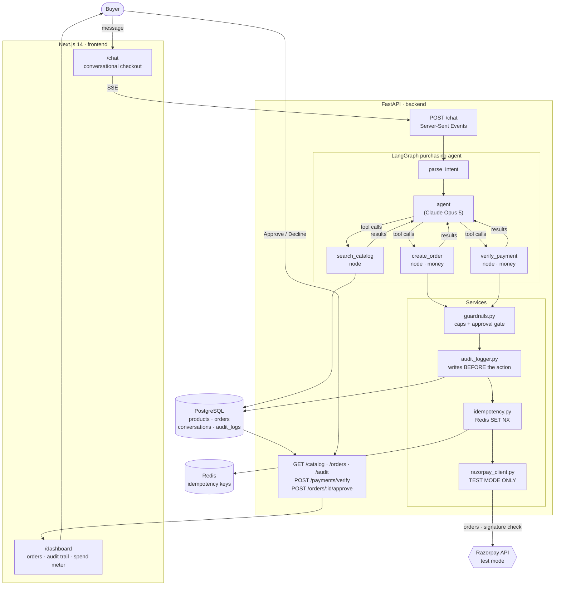
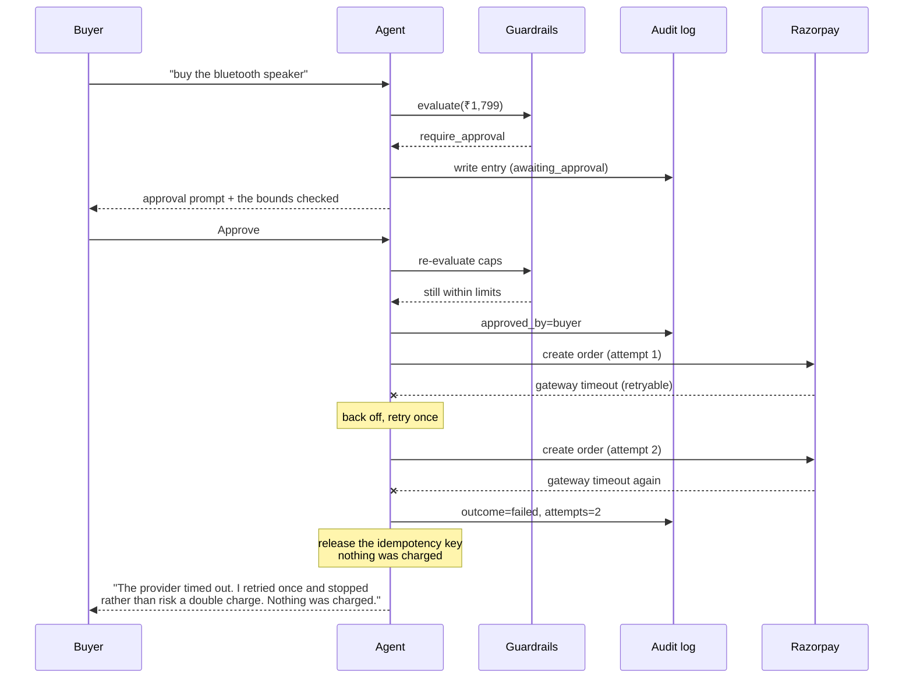
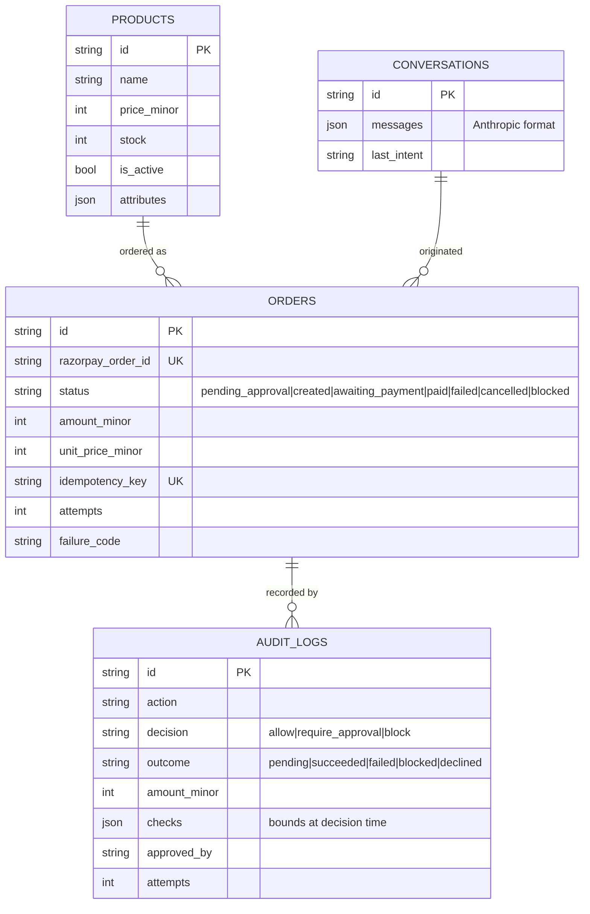

# AutoBuy — Architecture

Submission for the Razorpay AI Buildathon, **Track 01 — AI Growth & Agentic Commerce**.

> The bar: *every money action explainable, bounded and gated. Show the audit
> trail and one failure handled gracefully.*

This document explains how the system meets that bar, and why it is built the
way it is.

---

## 1. The whole system



---

## 2. The money path

Every money action runs this exact sequence. The **ordering is the design**:

```
1. validate the product, compute the amount server-side
2. reserve the idempotency key
3. guardrails.evaluate()   ->  allow | require_approval | block
4. WRITE THE AUDIT ENTRY   <-  before anything irreversible
5. persist the local Order row
6. only now call Razorpay, retrying once on a retryable failure
7. update the order AND the audit entry with what happened
```

### Why step 4 comes before step 6

An audit trail written *after* an action has no record of the most dangerous
case: the process dying mid-charge. The worst outcome would produce the least
evidence.

Writing first inverts that. An entry left in `pending` is itself the finding —
it says the agent was about to spend and never reported back. Audit entries are
committed in their own transaction, separately from the business write, so
rolling back an order cannot take the evidence with it.

### Why the gate lives in the service

`services/orders.create_order()` is the single choke point every caller passes
through: the agent's tool, the approval endpoint, and anything added later. A
gate implemented in the agent could be bypassed by calling the service directly.

The graph reinforces this structurally — `create_order` and `verify_payment` are
their own **named nodes**, not branches inside a generic executor.
`_validate_tool_coverage()` raises at import if a money tool is ever routed to a
non-gated node, and a test asserts it.

---

## 3. Bounded: the three verdicts

`services/guardrails.py` returns one verdict plus every bound it evaluated.

| Amount | Verdict | Behaviour |
|---|---|---|
| ≤ `AUTO_APPROVE_LIMIT_MINOR` (₹500) | `allow` | executes immediately |
| ≤ `PER_TRANSACTION_CAP_MINOR` (₹2,000) | `require_approval` | order held at `pending_approval`; **nothing charged** |
| above the cap, or over `DAILY_CAP_MINOR` (₹10,000/24h) | `block` | refused; Razorpay is never contacted |

Three properties are deliberate:

**Hard caps are evaluated before the approval threshold.** Reversed, a buyer
could be prompted to authorise an amount the merchant has forbidden. A cap a
human can click through is not a cap.

**The daily cap counts `created`, `awaiting_payment`, and `paid`.** A created
Razorpay order is a live commitment. Counting only `paid` would let the agent
open unlimited orders and stay under the cap forever; counting `blocked` or
`failed` would charge the buyer's budget for spend that never happened.

**Bounds are snapshotted into the audit entry, not recomputed.** The record
stays truthful after the configured caps change.

---

## 4. Gated: human approval

Approval is a `POST /orders/{id}/approve` against a specific order id.

It is **never** the model reading "yes" in the transcript. A confirmation
inferred from conversation text is one a prompt injection can forge; a button
press is an action only the person at the keyboard can take.

Caps are **re-evaluated at approval time**. A buyer may approve slowly and other
spend can land in between — an approval is permission for an amount, not a
bypass of the daily cap. An approval that would now breach a cap is refused and
recorded as `declined by guardrails`.

---

## 5. Explainable: the audit trail

`audit_logs` records one row per attempted money action:

| Column | Purpose |
|---|---|
| `agent_id`, `action`, `amount_minor` | who did what, for how much |
| `decision` | `allow` / `require_approval` / `block` |
| `outcome` | `pending` → `succeeded` / `failed` / `blocked` / `declined` |
| `checks` | every bound, its limit, and the observed value **at decision time** |
| `reason` | the human-readable explanation |
| `approved_by`, `approved_at` | who authorised it |
| `attempts` | provider attempts, so a retry is visible |
| `duration_ms`, `failure_code`, `failure_reason` | what happened |

A real run:

```
aud-250f6c4c2f78  create_order  ₹1,799.00
  decision=require_approval -> outcome=failed   attempts=2   by=buyer
  failure: provider_unavailable — Razorpay gateway timed out
    [ok  ] per_transaction_cap    ₹1,799.00 / ₹2,000.00
    [ok  ] daily_cap              ₹3,098.00 / ₹10,000.00
    [FAIL] auto_approve_limit     ₹1,799.00 / ₹500.00

aud-5620b7237689  create_order  ₹2,499.00
  decision=block -> outcome=blocked   attempts=0
    [FAIL] per_transaction_cap    ₹2,499.00 / ₹2,000.00

aud-6e76928d2e8b  create_order  ₹1,299.00
  decision=require_approval -> outcome=succeeded   attempts=1   by=buyer
```

`attempts=2` is the retry. `attempts=0` proves Razorpay was never contacted for
the blocked order.

---

## 6. One failure, handled gracefully



**Retried once, deliberately.** A gateway that is failing rarely recovers in
milliseconds, and every extra attempt widens the window in which a charge could
land twice. Deterministic rejections are not retried at all — the same bad
request produces the same failure.

The failed order **releases** its idempotency key: nothing was charged, so a
genuine retry must be able to proceed.

---

## 7. No double charges

Three overlapping layers, because one is not enough:

1. **Redis `SET NX`** reserves the key before the provider call, so a concurrent
   retry is refused rather than racing. Falls back to an in-process store when
   `REDIS_URL` is unset — correct for a single worker.
2. **A unique index** on `orders.idempotency_key`, which holds even if Redis is
   flushed or unavailable.
3. **A replay lookup** so a repeat returns the original order, not an error.

The key is derived from the model's own `tool_use` id, so an internal retry of
one call reuses it while a genuine second purchase gets a new one.

---

## 8. Data model



`amount_minor` is denormalised onto the order at creation. It is what was
actually sent to Razorpay, and it must stay pinned even if the catalog price
changes later.

---

## 9. Notable choices

| Choice | Why |
|---|---|
| LangGraph for the state machine, **official `anthropic` SDK** for the model call | `langchain-anthropic` is one more wrapper between this code and the API, and it lags it. LangGraph earns its place as an explicit, inspectable state machine — which is what "bounded and gated" needs. |
| Money tools get **their own graph nodes** | Makes the gate structural rather than a conditional buried in an executor. |
| `conversation_id` set by the **agent**, not the model | Otherwise a prompt injection could attribute an order to another buyer's thread. |
| The model never passes an **amount** | Totals are computed server-side from the catalog price. |
| Payment verification is **not** an agent tool | A signature check is a security control; a control that only runs if a language model chooses to call a tool is not a control. |
| Amounts in **minor units** everywhere | Floating-point rupees are how you charge someone ₹0.01 or ₹100. `display` strings are for humans only. |
| A **swappable brain** (`AGENT_MODE`) | The planner and Claude satisfy the same `LLMClient` protocol. Swapping in a keyword table leaves every cap, gate and audit row identical — which demonstrates that the safety properties are not enforced by the model. |
| Test mode enforced at **startup** | `config.py` refuses to boot on a key without the `rzp_test_` prefix. |
| Hand-written **SSE client** | `EventSource` cannot issue POST. Frame boundaries match `\r?\n\r?\n` — `sse-starlette` emits CRLF, and splitting on `\n\n` silently buffers the whole stream. |

---

## 10. Running it

See the [root README](../README.md) for setup, and
[demo-script.md](./demo-script.md) for the five-minute walkthrough.

```bash
cd backend && pytest        # 158 tests
cd frontend && npm run test # 7 tests
```
